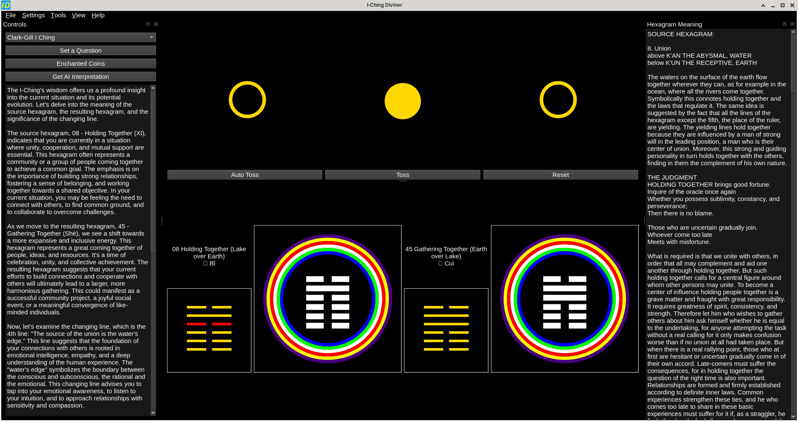

# IChingDiviner



A modern I-Ching divination application with traditional coin toss, hexagram meanings, mandala visualization, and optional AI interpretations.

## Features

- **Traditional 3-coin divination** with changing lines
- **Complete Hexagram meanings are displayed** (public domain)
- **Hexagram mandalas** - unique seven-circle visualization
- **Tarot mode** for personal deck images
- **AI interpretations** - Groq, Mistral, OpenAI, Ollama support
- **Save/load divinations** in JSON format
- **Mouse entropy** for true randomness
- **Dark theme** interface
- **Cross-platform** - Linux (Flatpak), Windows, macOS

## Quick Start

1. Download hexagram meanings: File → Download Meanings
2. Toss coins: "Toss" (line by line) or "Auto Toss"
3. Read interpretation in right dock
4. Optional: Configure AI in Tools → AI Model Selector

## Build from Source

```bash
git clone https://github.com/alamahant/IChingDiviner
cd IChingDiviner
mkdir build && cd build
cmake ..
make